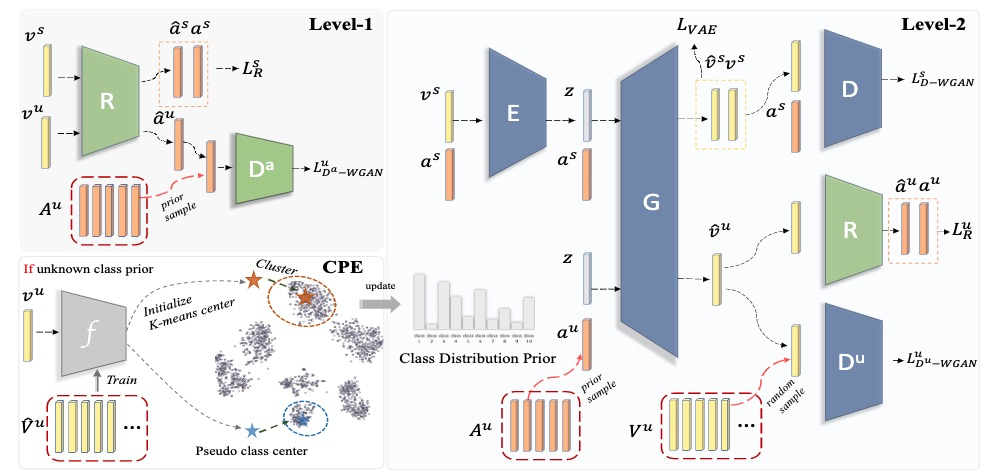
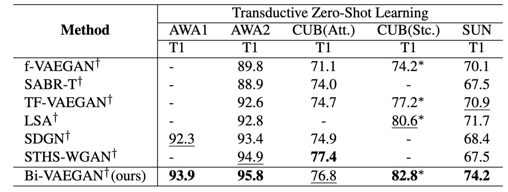

# Bi-directional Distribution Alignment for Transductive Zero-Shot Learning


Zero-shot learning (ZSL) suffers intensely from the domain shift issue, i.e., the mismatch (or misalignment) between the true and learned data distributions for classes without training data (unseen classes). By learning additionally from unlabelled data collected for the unseen classes, transductive ZSL (TZSL) could reduce the shift but only to a certain extent.
To improve TZSL, we propose a novel  approach Bi-VAEGAN which strengthens the distribution alignment between the visual space and an auxiliary space. 

## **Requirements**
The code is built upon library of [TF-VAEGAN](https://github.com/akshitac8/tfvaegan), and versions newer than TF-VAEGAN's prerequisites should work fine with this code.
```
numpy
torch
sklearn
tensorboardX 
```
# **Data preparation**
Download extracted AwA1, AwA2, CUB, FLO, SUN feature datasets from here, these data are mostly the same with TF-VAEGAN:
```  
https://drive.google.com/file/d/1Uax5IbQCaZhh7BAbwxos7Gq8SAKKbWbe/view?usp=share_link
 ```
# **Training with known class prior**
Check the scripts in ```scripts``` directory,

``` 
bash scripts/awa.sh
 ```
# **Training with unknown class prior**
Specify ```--unknown_classDistribution``` in the script and choose a prior estimation method like ```--prior_estimation 'CPE'```, 

``` 
#bash scripts/awa.sh
    ...
    --unknown_classDistribution 
    --prior_estimation 'CPE'
    ...
 ```
# **Result**
TZSL accuracy under known class prior:

